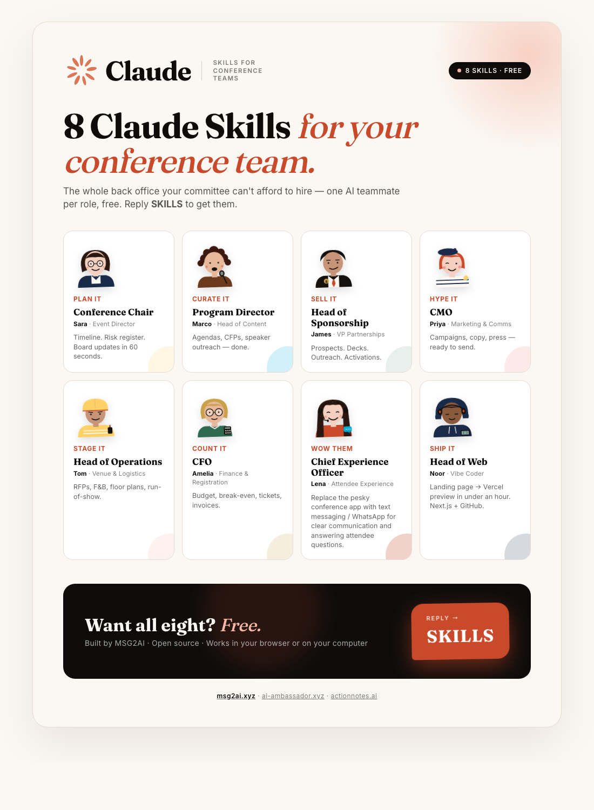

# Conference Team Skills for Claude

**8 free Claude skills — one for every seat on your conference org chart, plus a vibe coder to ship the website.**

Built by [MSG2AI](https://msg2ai.xyz) · AI Ambassador for attendees · ActionNotes for sessions

<p align="center">
  <a href="./docs/campaign-visual.html">
    
  </a>
  <br/>
  <em>The 8 AI teammates · <a href="./docs/campaign-visual.html">view the animated visual</a></em>
</p>

---

## What this is

Every conference organizing committee has the same 7 roles. Most teams have 1–3 people trying to cover all of them. These Claude skills give each role its own AI counterpart — trained on what that role actually does, wired into the connectors you already use (Gmail, Google Calendar, Google Drive, Zoho CRM). Plus an 8th skill — a **Vibe Coder** — that ships the event website to production with Next.js, Vercel, and GitHub.

Install one skill or all eight. Each is self-contained.

> **Heads up — you'll need a GitHub account to pull these skills onto your machine.** Whether you install via `npx` or clone manually, the install runs `git clone` against this public repository, so you need (a) Git installed locally and (b) a free [github.com](https://github.com) account so the clone can authenticate when needed (HTTPS works without auth on public repos, but a GitHub account avoids rate limits and lets you contribute back). If you don't want to use GitHub at all, see [Option 5 — Claude.ai Projects](#option-5--claudeai-projects-co-work--non-technical-users) for a no-Git, browser-only path.

---

## New to Claude? Start here

### What is Claude?

Claude is an AI assistant made by Anthropic. You talk to it the way you'd brief a colleague — in plain English, with as much or as little context as you want — and it writes, plans, researches, and produces finished work back. There are two ways to use Claude with this repo:

- **Claude.ai** — the browser app at [claude.ai](https://claude.ai). Sign in, open a project, paste a skill, start chatting. No installation.
- **Claude Code** — Claude on your computer (terminal, desktop app, or IDE extension). Same conversation, but Claude can also read your files, send emails, update calendars, and use tools you connect.

Either works for these skills. Claude.ai is the fastest way to try one. Claude Code is more powerful once you have recurring workflows and want Claude to act on real systems.

### What are Claude Skills?

A Claude skill is a prepared brief that turns Claude into a specialist for a specific job. Instead of re-explaining "I'm running a 1,000-person event, here's how I think about sponsorship" every time you start a chat, you load the **Sponsorship Lead** skill once and Claude already knows what to ask, what good output looks like, and which tools to use.

Skills don't change Claude itself — they give Claude the context a strong onboarding doc would give a new hire on their first week.

A skill is just a markdown file with two parts:
1. **A description** with trigger phrases — Claude uses this to decide when to activate the skill.
2. **The brief itself** — the role, capabilities, working style, and tools.

That's it. No code, no build. Open any `SKILL.md` file in this repo and you can read exactly what Claude is being told.

### How these skills can be used

Each skill listens for the questions and requests that role would actually receive. You don't need to call them by name — just ask the question and the right skill activates.

**Example prompts that "just work" once installed:**

| When you say… | The skill that activates | What you get back |
|---|---|---|
| "Build a 9-month timeline for a 500-person summit on Sept 15" | General Chair | A milestone critical path with owners, deadlines, dependencies |
| "Find 30 prospective sponsors for our fintech conference" | Sponsorship | A scored prospect list with fit, contact, and outreach angle |
| "Write a Call for Speakers for the AI track" | Program & Content | Publish-ready CFP copy, submission categories, review rubric |
| "Build the 12-week pre-event email campaign" | Marketing & Comms | A week-by-week calendar with subject lines, copy, segments |
| "Compare these 3 venue proposals" | Venue & Logistics | A scored comparison table with risks and a recommendation |
| "What's our break-even at $895 ticket price?" | Finance & Registration | A break-even model with attendance scenarios and sensitivity |
| "Design the on-site attendee experience" | Attendee Experience | An end-to-end attendee journey, with AI Ambassador for live help |
| "Spin up the event landing page and ship it to Vercel today" | Vibe Coder | A live preview URL, GitHub repo, and a polished Next.js site pulling from your KB |

**Skills also work together.** When you ask the General Chair for a board update, it pulls the sponsor pipeline from Sponsorship, budget from Finance, and speaker confirms from Program — you don't coordinate, they share context.

---

## First step for every skill: a shared Knowledge Base

Every skill is designed to read from — and write to — one **shared Knowledge Base** for your event. This is the very first thing to set up. It can live anywhere your team already keeps documents:

- **Google Drive** folder (most common)
- **Dropbox** folder
- **OneDrive / SharePoint / Box** folder
- **Notion** workspace
- Local folder synced to any of the above

The skills expect this canonical structure (the General Chair skill will create it for you if you don't have one):

```
event-knowledge-base/
├── 01-event-brief/        ← theme, dates, audience, scale, goals
├── 02-brand-and-voice/    ← logos, colors, tone, past decks
├── 03-prior-events/       ← past agendas, sponsor lists, NPS reports
├── 04-sponsors/           ← pipeline, contracts, deliverables
├── 05-speakers/           ← bios, headshots, slides, briefings
├── 06-venue-logistics/    ← venue contracts, vendors, run-of-show
├── 07-finance-registration/  ← budget, invoices, registration data
├── 08-attendees/          ← segments, registration exports, feedback
├── 09-meeting-notes/      ← committee notes, decisions, action items
└── 10-msg2ai-export/      ← generated JSON for hello.msg2ai.xyz
```

### Bootstrap from an existing website (Firecrawl)

If you already have an event website, you don't need to fill the Knowledge Base by hand. The skills will use **Firecrawl** to crawl your site and extract structured information — name, dates, location, theme, audience, ticket tiers, current speakers, sponsors, agenda, partner logos. The structured summary lands in `01-event-brief/from-website.md` and the raw JSON in `03-prior-events/`. This is the same approach used by the MSG2AI server's website-extraction pipeline.

To set up Firecrawl: `bash setup/setup-firecrawl.sh`

---

## The 8 Skills

| Skill | Role | Key Capabilities |
|---|---|---|
| [`conference-general-chair`](./conference-general-chair/) | General Chair / Event Director | Timeline, committee coordination, risk register, board briefings |
| [`conference-program-chair`](./conference-program-chair/) | Program & Content Chair | Agenda design, CFP, speaker outreach, peer review, run-of-show |
| [`conference-sponsorship-lead`](./conference-sponsorship-lead/) | Sponsorship Lead | Prospect research, deck tailoring, outreach sequences, contracts, activation tracking |
| [`conference-marketing-comms`](./conference-marketing-comms/) | Marketing & Communications | Campaign planning, copy generation, PR, post-event storytelling |
| [`conference-venue-logistics`](./conference-venue-logistics/) | Venue & Logistics Coordinator | Venue RFPs, F&B, floor plans, vendor management, run-of-show |
| [`conference-finance-registration`](./conference-finance-registration/) | Finance & Registration Chair | Budget modeling, registration tiers, sponsor invoicing, expense tracking |
| [`conference-attendee-experience`](./conference-attendee-experience/) | Attendee Experience Lead | On-site helpdesk, networking, session reminders, NPS — powered by AI Ambassador + ActionNotes |
| [`conference-vibe-coder`](./conference-vibe-coder/) | Vibe Coder / Web Builder | Landing pages, full event sites, sponsor microsites, registration pages — ships to Vercel via Next.js + GitHub |

---

## Prerequisites

Before installing, you need **one** of the following depending on which method you choose:

| Method | What you need | Best for |
|---|---|---|
| npx (Option 1) | Node.js 18+ | Quickest install — one command |
| Plugin (Option 2) | Git + Claude Code | Namespaced, managed via `/plugin` |
| Git clone (Option 3) | Git + Claude Code CLI | Developers, full control |
| Desktop / IDE (Option 4) | Git + Claude Code desktop or extension | Visual workflow users |
| Claude.ai Co-Work (Option 5) | A Claude.ai account (Pro, Team, or Enterprise) | Non-technical users, no install |
| ZIP download (Option 6) | A web browser | Anyone, no tools needed |

### Installing Git (required for Options 2, 3, and 4)

Git is the tool that downloads this repository to your computer.

<details>
<summary><strong>Mac</strong></summary>

Open **Terminal** (search for "Terminal" in Spotlight with `Cmd + Space`):

```bash
# Option A — Install via Xcode Command Line Tools (easiest)
xcode-select --install

# Option B — Install via Homebrew (if you have Homebrew)
brew install git
```

Verify it worked:

```bash
git --version
```

You should see something like `git version 2.x.x`.

</details>

<details>
<summary><strong>Windows</strong></summary>

1. Download Git from [git-scm.com/download/win](https://git-scm.com/download/win)
2. Run the installer — accept all default settings
3. Open **Git Bash** (installed with Git) or **PowerShell**

Verify it worked:

```bash
git --version
```

You should see something like `git version 2.x.x`.

</details>

<details>
<summary><strong>Linux</strong></summary>

Open your terminal:

```bash
# Ubuntu / Debian
sudo apt update && sudo apt install git -y

# Fedora
sudo dnf install git -y

# Arch
sudo pacman -S git
```

Verify it worked:

```bash
git --version
```

</details>

---

## Installation

### Option 1 — One command with npx (easiest)

> Works on Mac, Windows, and Linux. Requires Node.js 18+ ([download here](https://nodejs.org)).

```bash
npx @msg2ai/conference-team-skills install
```

That's it. The installer clones the skills into `~/.claude/skills/conference-team-skills/` and they're immediately available in Claude Code.

**Other npx commands:**

```bash
npx @msg2ai/conference-team-skills list        # See all 8 skills
npx @msg2ai/conference-team-skills update      # Update to the latest version
npx @msg2ai/conference-team-skills uninstall   # Remove the skills
```

> Published on npm at [`@msg2ai/conference-team-skills`](https://www.npmjs.com/package/@msg2ai/conference-team-skills).

---

### Option 2 — Claude Code Plugin

> Plugins are namespaced and can be managed with the `/plugin` command inside Claude Code.

**Install from GitHub:**

```bash
claude --plugin-dir /path/to/conference-team-skills
```

Or clone the repo first, then load it:

```bash
git clone https://github.com/msg2ai/conference-team-skills.git
claude --plugin-dir ./conference-team-skills
```

Once loaded, skills are available as namespaced commands:

```
/conference-team-skills:conference-general-chair
/conference-team-skills:conference-sponsorship-lead
/conference-team-skills:conference-marketing-comms
```

(and so on for all 8 skills)

---

### Option 3 — Git clone (manual)

> For developers who want full control. Skills are automatically available to Claude Code in every conversation.

**Step 1: Install Claude Code** (if you don't have it yet)

```bash
npm install -g @anthropic-ai/claude-code
```

> Requires Node.js 18+. Download Node.js from [nodejs.org](https://nodejs.org) if you don't have it.

**Step 2: Clone the skills into your Claude skills directory**

<details>
<summary><strong>Mac / Linux</strong></summary>

```bash
git clone https://github.com/msg2ai/conference-team-skills.git ~/.claude/skills/conference-team-skills
```

</details>

<details>
<summary><strong>Windows (PowerShell)</strong></summary>

```powershell
git clone https://github.com/msg2ai/conference-team-skills.git "$env:USERPROFILE\.claude\skills\conference-team-skills"
```

</details>

<details>
<summary><strong>Windows (Git Bash)</strong></summary>

```bash
git clone https://github.com/msg2ai/conference-team-skills.git ~/.claude/skills/conference-team-skills
```

</details>

**Step 3: Verify**

```bash
ls ~/.claude/skills/conference-team-skills/
```

You should see eight folders: `conference-general-chair`, `conference-program-chair`, `conference-sponsorship-lead`, `conference-marketing-comms`, `conference-venue-logistics`, `conference-finance-registration`, `conference-attendee-experience`, `conference-vibe-coder`.

**Step 4: Use a skill**

Open Claude Code and type a natural prompt that matches a skill:

```
Plan the conference timeline — our event is September 15, 500 attendees
```

Claude Code will automatically pick up the `conference-general-chair` skill. You can also invoke a skill directly:

```
/conference-general-chair
```

---

### Option 4 — Claude Code Desktop App or IDE Extension

> Works in the Claude Code Mac/Windows desktop app and in VS Code / JetBrains IDE extensions.

**Step 1: Clone the repo somewhere on your computer**

<details>
<summary><strong>Mac / Linux</strong></summary>

```bash
git clone https://github.com/msg2ai/conference-team-skills.git ~/.claude/skills/conference-team-skills
```

</details>

<details>
<summary><strong>Windows (PowerShell)</strong></summary>

```powershell
git clone https://github.com/msg2ai/conference-team-skills.git "$env:USERPROFILE\.claude\skills\conference-team-skills"
```

</details>

**Step 2: Open Claude Code** in the desktop app or your IDE extension.

The skills are automatically detected from `~/.claude/skills/`. No additional configuration needed.

---

### Option 5 — Claude.ai Projects (Co-Work / non-technical users)

> No installation, no terminal, no Git. Works entirely in the browser.

1. Go to [claude.ai](https://claude.ai) and sign in
2. Click **Projects** in the left sidebar, then **Create Project**
3. Name the project after your event (e.g., "TechSummit 2026 — Sponsorship")
4. In the project, click the **pencil icon** next to "Project instructions" (or go to **Project Settings**)
5. Open the skill file you want from this repository:
   - [`conference-general-chair/SKILL.md`](./conference-general-chair/SKILL.md)
   - [`conference-program-chair/SKILL.md`](./conference-program-chair/SKILL.md)
   - [`conference-sponsorship-lead/SKILL.md`](./conference-sponsorship-lead/SKILL.md)
   - [`conference-marketing-comms/SKILL.md`](./conference-marketing-comms/SKILL.md)
   - [`conference-venue-logistics/SKILL.md`](./conference-venue-logistics/SKILL.md)
   - [`conference-finance-registration/SKILL.md`](./conference-finance-registration/SKILL.md)
   - [`conference-attendee-experience/SKILL.md`](./conference-attendee-experience/SKILL.md)
   - [`conference-vibe-coder/SKILL.md`](./conference-vibe-coder/SKILL.md)
6. Click on the file, then click **Raw** (top-right of the file view) to see the plain text
7. **Copy everything** from the file and **paste** it into the project instructions box
8. Click **Save**

Every new conversation in that project will now use that skill. Create separate projects for different roles, or combine multiple skill files into one project.

---

### Option 6 — Download as ZIP (no Git required)

1. Go to [github.com/msg2ai/conference-team-skills](https://github.com/msg2ai/conference-team-skills)
2. Click the green **Code** button
3. Click **Download ZIP**
4. Extract the ZIP file

Then either:
- **For Claude Code**: Move the extracted folder to `~/.claude/skills/conference-team-skills`
- **For Claude.ai**: Open any `SKILL.md` file in a text editor and paste its contents into your project instructions (see Option 5, steps 4–8)

---

## Connecting integrations (optional but recommended)

These skills can send emails, check calendars, manage projects, and access documents when you connect Claude to your tools.

### Quick setup (Claude Code)

Run the setup script for any integration you want to connect:

```bash
# Set up a single integration
bash setup/setup-gmail.sh

# Or set up everything at once (interactive — pick which ones you want)
bash setup/setup-all.sh
```

### Available integrations

| Integration | Setup script | What it enables | Used by |
|---|---|---|---|
| **Shared Knowledge Base** | (Google Drive / Dropbox / OneDrive / Notion) | Single source of truth — every skill reads & writes here. **Set up first.** | All skills |
| **Firecrawl** | `setup-firecrawl.sh` | Bootstrap the Knowledge Base from an existing event website; competitor & venue research | All skills |
| **hello.msg2ai.xyz** | (no setup) | Upload destination for the exported event JSON; powers helpdesk, AI Ambassador, attendee app | All skills |
| AgentMail | `setup-agentmail.sh` | AI-native email inboxes for outreach, invoicing, notifications | All skills |
| Gmail | `setup-gmail.sh` | Send outreach, confirmations, invoices | All skills |
| Google Calendar | `setup-google-calendar.sh` | Event milestones, schedule calls | General Chair, Program, Venue, Finance |
| Google Drive | `setup-google-drive.sh` | Documents, contracts, templates | All skills |
| Zoom | `setup-zoom.sh` | Meeting recordings, speaker briefings, tech checks | General Chair, Program, Venue, Attendee |
| Canva | `setup-canva.sh` | Social graphics, decks, signage, infographics | Marketing, Sponsorship, Venue, Attendee |
| Twenty CRM | `setup-twenty-crm.sh` | Contact/pipeline management, sponsor tracking | Sponsorship, Finance, Program, Venue, Attendee |
| ClickUp | `setup-clickup.sh` | Project/task management, boards, checklists | All skills |
| Asana | `setup-asana.sh` | Project/task management (alternative to ClickUp) | All skills |
| Vercel | `setup-vercel.sh` | Event website deployment and management | Marketing |
| Obsidian | `setup-obsidian.sh` | Knowledge base, notes, institutional memory | All skills |

> **Note:** You don't need all integrations. Each skill works without any connectors — integrations just make them more powerful. Pick the ones your team already uses.

### In Claude.ai (browser)

Go to **Settings** (bottom-left) → **Integrations** and connect Gmail, Google Calendar, Google Drive, Zoom, Canva, or Vercel directly. These are automatically available in Claude Code when you're logged into the same account.

---

## Updating the skills

To get the latest version of the skills:

<details>
<summary><strong>If you installed with Git or npx (Options 1, 3, or 4)</strong></summary>

```bash
cd ~/.claude/skills/conference-team-skills
git pull
```

On Windows PowerShell:

```powershell
cd "$env:USERPROFILE\.claude\skills\conference-team-skills"
git pull
```

</details>

<details>
<summary><strong>If you downloaded the ZIP (Option 6)</strong></summary>

Download the ZIP again from [the repository](https://github.com/msg2ai/conference-team-skills) and replace the old folder.

</details>

<details>
<summary><strong>If you pasted into Claude.ai (Option 5)</strong></summary>

Visit the SKILL.md file on GitHub, copy the updated contents, and paste them into your project instructions again.

</details>

---

## Troubleshooting

<details>
<summary><strong>"git: command not found"</strong></summary>

Git is not installed. Follow the [Installing Git](#installing-git-required-for-options-2-3-and-4) instructions above for your operating system.

</details>

<details>
<summary><strong>"npm: command not found" (when installing Claude Code CLI)</strong></summary>

Node.js is not installed. Download it from [nodejs.org](https://nodejs.org) — choose the LTS version. After installing, close and reopen your terminal, then try again.

</details>

<details>
<summary><strong>Skills not showing up in Claude Code</strong></summary>

1. Make sure the files are in the right location:
   ```bash
   ls ~/.claude/skills/conference-team-skills/conference-general-chair/SKILL.md
   ```
   If this shows "No such file or directory", the clone went to the wrong place. Re-run the `git clone` command from the installation steps.

2. Make sure each skill folder contains a `SKILL.md` file with a `---` frontmatter block at the top containing `name:` and `description:` fields.

3. Restart Claude Code after cloning.

</details>

<details>
<summary><strong>Permission denied errors on Mac/Linux</strong></summary>

If you get permission errors when cloning:

```bash
mkdir -p ~/.claude/skills
git clone https://github.com/msg2ai/conference-team-skills.git ~/.claude/skills/conference-team-skills
```

</details>

<details>
<summary><strong>Windows: path too long errors</strong></summary>

Run this in an Administrator PowerShell and try again:

```powershell
git config --global core.longpaths true
```

</details>

---

## The Attendee Experience skill

This skill is different from the others. It runs on two live tools:

**[AI Ambassador](https://ai-ambassador.xyz)** — SMS and WhatsApp attendee concierge. No app download. 30-second response time. 126 languages. Handles the entire attendee-facing operation on show day: helpdesk, wayfinder, networking matchmaker, session reminders, sponsor messaging, post-event NPS.

**ActionNotes** — AI-powered session and meeting capture. Turns attendee sessions and post-event debriefs into structured notes, action items, and next-year improvement plans automatically.

---

## Repository structure

```
conference-team-skills/
├── README.md                  ← You are here
├── LICENSE                    ← MIT license
├── package.json               ← npm package config (enables npx)
├── bin/
│   └── cli.js                 ← npx installer CLI
├── .claude-plugin/
│   └── plugin.json            ← Claude Code plugin manifest
├── setup/                     ← Integration setup scripts
│   ├── setup-all.sh           ← Run all setups interactively
│   ├── setup-gmail.sh
│   ├── setup-google-calendar.sh
│   ├── setup-google-drive.sh
│   ├── setup-zoom.sh
│   ├── setup-canva.sh
│   ├── setup-twenty-crm.sh
│   ├── setup-clickup.sh
│   ├── setup-asana.sh
│   ├── setup-firecrawl.sh
│   ├── setup-vercel.sh
│   └── setup-obsidian.sh
├── conference-general-chair/
│   └── SKILL.md               ← General Chair skill
├── conference-program-chair/
│   └── SKILL.md               ← Program & Content Chair skill
├── conference-sponsorship-lead/
│   └── SKILL.md               ← Sponsorship Lead skill
├── conference-marketing-comms/
│   └── SKILL.md               ← Marketing & Communications skill
├── conference-venue-logistics/
│   └── SKILL.md               ← Venue & Logistics skill
├── conference-finance-registration/
│   └── SKILL.md               ← Finance & Registration skill
├── conference-attendee-experience/
│   └── SKILL.md               ← Attendee Experience skill
└── conference-vibe-coder/
    └── SKILL.md               ← Vibe Coder / Web Builder skill
```

---

## About MSG2AI & related projects

Building AI infrastructure for events, hospitality, and B2B operations.

- **[msg2ai.xyz](https://msg2ai.xyz)** — MSG2AI, the parent company
- **[AI Ambassador](https://ai-ambassador.xyz)** — SMS/WhatsApp event concierge (no app download, 126 languages, 30-second responses) · [contact](mailto:hello@ai-ambassador.xyz)
- **[ActionNotes](https://actionnotes.ai)** — AI-powered session capture and meeting notes · [actionnotes.ai](https://actionnotes.ai)
- **Contact MSG2AI:** [bart@msg2ai.xyz](mailto:bart@msg2ai.xyz)

---

## License

MIT — free to use, modify, and redistribute. Attribution appreciated but not required.
